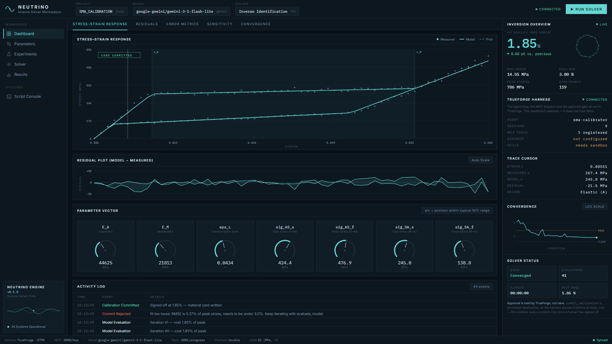

# NEUTRINO — Inverse Solver Workstation

**SMA calibration agent, built on TrueForge.**

An agent that inverse-identifies the 7 parameters of a superelastic
shape-memory-alloy (SMA / NiTi) constitutive model from a noisy tensile-test
trace — the thing a materials engineer normally does by hand over hours of
trial and error — and asks a human to sign off before it trusts the result.



### What this is, and what it is not

This is a **working prototype**, not a product. The agent is real: it drives
TrueForge's API, calls a custom MCP server, and stops at a human approval gate
before writing anything irreversible. What it is not is finished — the material
model is a fast closed-form surrogate rather than an Abaqus solve, the dataset
is one synthetic specimen, and the workstation implements the calibration
workflow only.

NEUTRINO is the first module of **MODULON**, a suite I am building out to cover
the rest of the computational-mechanics pipeline — data ingestion, model setup,
solver orchestration, validation and reporting — as one environment rather than
the spreadsheets and one-off scripts that chain those steps together today.
Seventeen modules are scoped; this one is built. Nothing in this repository
depends on the others existing, and none of the rest is claimed as working
software here.

## Architecture

TrueForge is the host. It is what lets a model drive the solver at all: without
the harness this is a Python module you call by hand; with it, the search is
driven by a model that reads the residual and decides what to change next.

```
                    ┌──────────────────────────────┐
                    │        LLM  (Gemini)         │
                    └──────────────┬───────────────┘
                                   │  model calls
                    ┌──────────────▼───────────────┐
                    │      TRUEFORGE  :8790        │   ← the host
                    │  agent loop · sessions ·     │
                    │  MCP dispatch · APPROVAL GATE│
                    └───┬──────────────────────┬───┘
        registers/drives │                      │ tool calls
                         │                      │
        ┌────────────────▼──────┐   ┌───────────▼─────────────┐
        │  run_agent.py         │   │  server.py   :8000/mcp  │
        │  configure_trueforge  │   │  ┌───────────────────┐  │
        └────────────┬──────────┘   │  │ get_experimental… │  │
                     │              │  │ evaluate_model    │  │
                     │              │  │ commit_calibration│◄─┼── destructiveHint
                     │              │  └─────────┬─────────┘  │    (gated)
                     │              └────────────┼────────────┘
                     │                           │ writes
                     │              ┌────────────▼────────────┐
                     │              │  progress_state.json    │
                     │              │  sma_model.py (physics) │
                     │              └────────────┬────────────┘
                     │ approval handshake        │ polled
        ┌────────────▼───────────────────────────▼────────────┐
        │        dashboard_api.py  →  NEUTRINO  :8001         │
        │   charts · gauges · residuals · APPROVE / DENY      │
        └─────────────────────────────────────────────────────┘
```

The run can be started from either end, and the gate holds either way, but the
two paths are not the same underneath:

- **The workstation's RUN SOLVER button** launches `run_agent.py`, which
  registers the agent, opens a session and streams turns over TrueForge's HTTP
  API. The approval is relayed back through the dashboard.
- **TrueForge's own chat** drives the agent inside the harness itself.
  `run_agent.py` is not involved at all, and the approval is answered in
  TrueForge's UI.

`run_agent.py` is therefore one client of the harness, not a layer everything
passes through — which is the point of it: the same agent is reachable from the
harness's own interface and from code.

**The gate, precisely.** `commit_calibration` is annotated `destructiveHint` in
the MCP server. The agent's MCP entry sets
`require_approval_for_tools: ["@destructive"]`. TrueForge matches the annotation,
emits `tool.approval_required`, and stops the tool **before its Python body
runs**. Nothing continues until a `user.tool_approval` decision is posted back.

How a missing decision is treated depends on which path you are on. Started from
the dashboard, `run_agent.py` waits ten minutes and then **denies** — an
unanswered prompt must not become an approval when nobody is watching the
terminal. Run interactively it blocks at the prompt indefinitely, which is the
right behaviour when a person is sat in front of it. Driven from TrueForge's
chat, the wait is the harness's own.

## Where this came from

NEUTRINO is a prototype, and a deliberate one. The solver framing, the
parameterisation, the acceptance criteria and the search strategy come from my
own research work rather than from a library:

- around a year working on inverse solvers, in a **research workflow** — scripts
  and notebooks, not a product
- around six months formulating this particular solver framework
- one to two months building **MODULON**, the wider suite this belongs to

My earlier inverse-solver work targeted a different material problem. NEUTRINO
uses superelastic NiTi as its test subject and is built against **known data** —
a synthetic trace generated from a parameter set the agent never sees. For a
prototype that is the point: the question is whether the search recovers an
answer you already know, which is exactly what makes the result checkable. The
[sensitivity analysis](#for-judges--how-to-verify-this-in-5-minutes) below only
means anything because the truth is available to compare against.

Every MODULON module shares this interface language deliberately. The suite is
aimed at engineers reading numbers under pressure, so the priorities stay the
same throughout: dense but organised, every figure traceable to where it came
from, and nothing on screen the system cannot actually observe.

## What the agent does, and how it uses TrueForge

**The task.** A tensile test gives you a stress–strain curve. Recovering the
constitutive parameters that produced it is an inverse problem: you cannot solve
for them directly, you can only guess, simulate, compare, and adjust. Doing that
by hand for seven coupled parameters is an afternoon's work and the result
depends on who did it. The agent does the search; a human still signs the
result.

**What TrueForge actually runs.** Not a wrapper around a chat completion — the
harness owns every part of the loop:

| TrueForge feature | How this project uses it |
|---|---|
| **Agent + session + turn API** | `run_agent.py` registers the agent, opens a session and streams turns over `/api/v1` — the agent loop is TrueForge's, not a hand-rolled while-loop |
| **Remote MCP tool source** | `server.py` is registered as a remote MCP server; the harness performs discovery and dispatch, and reports the three tools back through `/mcp-servers/{name}/tools` |
| **Approval gate** | `commit_calibration` is annotated `destructiveHint`; the agent's MCP entry sets `require_approval_for_tools: ["@destructive"]`; the harness emits `tool.approval_required` and **stops the tool before its body runs** |
| **Approval resume** | the decision goes back as a `user.tool_approval` item on a follow-up turn — allow or deny, with the denial reason surfaced to the agent |
| **Model providers** | registered through `/settings/model-providers`; the model is swappable without touching project code |
| **Programmatic configuration** | `configure_trueforge.py` registers the MCP server, model, skill and sandbox through the API, so setup is reproducible and reviewable in git rather than clicked together |
| **Session state** | every run is retained by the harness; the dashboard reads the agent, session count and tool registration back from it |

**Where you can see it.** The dashboard's `TRUEFORGE HARNESS` panel reports the
harness's own state — agent name, sessions, registered tools, sandbox
availability — read live from `/api/v1`, so it goes blank if the harness stops.
The dashboard watches; it does not host the loop.

**What is not exercised, and why.** Sandbox and skills are unavailable on
Windows: TrueForge logs `LocalSandboxProvider supports macOS and Linux only
(got win32)`, and skills execute inside a sandbox, so both stay disabled without
a cloud provider. The panel says `not configured` and `needs sandbox` rather
than hiding it. `configure_trueforge.py --daytona-key` wires both up where a
provider is available.

**One upstream fix.** TrueForge 0.1.4 and 0.2.0-rc.0 do not start on Windows at
all — kysely's `FileMigrationProvider` calls `await import(filePath)` with an OS
path, so Node reads the drive letter as a URL scheme and startup dies with
`ERR_UNSUPPORTED_ESM_URL_SCHEME` before the HTTP listener opens.
`scripts/patch-kysely-esm.mjs` applies the documented fix from `postinstall`.
Reproduced on both C: and D:, so it affects any Windows user.

## AI assistance disclosure

Claude (Anthropic) was used extensively and wrote most of the code here, working
to a direction I set and reviewed as it went. The physics, the problem framing,
what the safety gate checks, and the entire design of the interface are mine.
The section below sets out exactly which decisions were which, including the
things Claude found that I would not have.

## Who built this, and which decisions were mine

<!-- Juni: check this reads the way you'd say it, and correct anything I've
     put slightly wrong — a judge may ask, and it should only claim what you
     can back up in conversation. -->

**Junaid Alam** — Mechanical Engineering, Panjab University, with research
internships at NIT Trichy and IIT Ropar.
[LinkedIn](https://www.linkedin.com/in/junaidalam-mechanical)

I work at the intersection of computational mechanics and material modelling:
finite-element analysis in Abaqus, UMAT/VUMAT development, material
characterisation including nanoindentation and Oliver–Pharr calibration, and
inverse identification of material parameters from experimental data.

What interests me is not running a simulation but the whole pipeline around it —
experimental data → material model → parameter identification → simulation →
validation. Most of that chain is still done by hand, in spreadsheets and
one-off scripts, by people who would rather be doing the engineering.

That is the part of this project I brought rather than looked up: that a
superelastic NiTi trace is described by seven parameters, which of them a single
load–unload cycle can actually constrain, what a physically admissible parameter
set looks like, and what a fit has to clear before anyone should trust it. It is
also why the agent is gated rather than autonomous — a material card is
something a person signs off on, and an inverse problem with weakly identified
parameters is exactly the case where an unsupervised optimiser will hand you a
confident, wrong answer.

### The design direction is mine

I wrote the original brief for the dashboard and every subsequent correction to
it. The decisions that shaped what you see:

- **An instrument, not a dashboard.** I ruled out the default AI-dashboard
  look — the near-black card with one neon accent, rounded everything, generic
  iconography — and asked for the control panel of a universal testing machine
  instead: dense, calm, built for reading numbers under pressure. The palette
  and the IBM Plex pairing were specified, not chosen for me.
- **Do not fake the approval state.** TrueForge holds `commit_calibration`
  before its body runs, so the progress feed has no signal for "a human is being
  asked right now". I decided the UI would say so rather than invent a
  confident-looking pending state, and that any inference would be labelled as
  one. Everything downstream of that — the amber `inferred` state, the caption
  admitting the limitation — follows from that call.
- **Show the measurements, not just the plot.** I pushed back when the
  experimental data existed only as plotted dots; the trace cursor, the raw
  sample readout and the dataset provenance panel exist because I asked where
  the numbers were.
- **Show what the fit is judged against.** I asked on what basis a calibration
  is validated, which is why the acceptance criteria are mirrored in the UI from
  the gate `commit_calibration` actually enforces, evaluated live, rather than
  described in prose.
- **The harness has to be visible.** I noticed the demo showed a terminal and a
  chart with no TrueForge anywhere, and that a judge would ask the same
  question. That is why the run is driven through the harness's own API and why
  the approval now surfaces in the dashboard instead of only in a terminal.
- **The workstation restructure.** The five-zone layout — command bar,
  navigation rail, central workspace, solver panel, status bar — came from a
  brief I wrote specifying the layout, the information hierarchy and the
  reference points (scientific instrumentation and mission control, explicitly
  not crypto, gaming or consumer SaaS).

I also drew the line on honesty in the chrome: the reference design carried
invented hardware readouts and a fake ETA, and those are not in this build. A
panel that reports fabricated numbers beside measured ones teaches a reader to
trust neither.

### What Claude did

Claude (Anthropic) wrote most of the code in this repository, working to the
direction above, and I reviewed it as it went. It also found things I would not
have: that TrueForge cannot start on Windows at all because of an upstream
`import()` bug in kysely, that `evaluate_model` returning the full predicted
curve made the agent's context grow quadratically until a free-tier budget ran
out, and that the residual means I had asked for were being averaged across
regimes governed by different parameters — which Qodo then flagged
independently.

The honest boundary: the physics, the problem framing, the safety criteria and
the entire design direction are mine; the implementation is largely Claude's,
written to that direction and reviewed by me, not accepted unread.

## Qodo Code Review Evidence

**Merged PR:** [#1 — Live calibration dashboard, local TrueForge harness, and a
Windows startup fix](https://github.com/junilabs-dev/sma-calibration-agent/pull/1)
(10 commits, 14 files, +6021/−43)

**What Qodo flagged — four bugs, two of them High:**

| # | Severity | Finding |
|---|---|---|
| 1 | High | `scripts/patch-kysely-esm.mjs` inserted the `pathToFileURL` import only when the file began with a `///` reference line |
| 2 | High | `stop.ps1` matched bare names like `server.py` across every python/node/pwsh process on the machine |
| 3 | Medium | `server.py` rewrote `progress_state.json` in place while the dashboard polled it |
| 4 | Medium | `start.ps1` read `TRUEFORGE_PORT` in the child launcher but checked and printed a hardcoded 8790 |

**What I changed — all four fixed, none dismissed** (commit `c541146`):

1. kysely does currently start with that reference line, so the patch worked —
   but `String.replace` with no match returns its input unchanged, so if that
   line ever went away the patch would have added a call to an undefined
   function and failed at migration time with no warning. The import now lands
   unconditionally, after any leading reference lines.
2. This was the worst of the four, because the script's own comment claimed
   unrelated processes were left alone while the code did the opposite. It
   would have killed another checkout's `server.py`. It now matches the
   checkout path, which every process started here carries on its command line.
3. A poll landing mid-write read a half-written file and reported `NO SIGNAL`
   on a healthy run — the kind of fault that only shows up while being
   demonstrated. The write goes through a temp file and an atomic rename, and
   the dashboard holds its last good state until three consecutive failures.
4. A custom port started fine and then failed its own health check for 75
   seconds. The resolved port now flows through the check, the URL and the
   browser launch.

**Verification, rather than assertion:** the patch was re-tested against a
kysely file with the reference line deliberately removed; 150 writes against
three concurrent pollers produced zero corrupt reads; and `TRUEFORGE_PORT=8795`
now reports `[ok]`.

**PR history:** Qodo's first pass raised the four findings above. After
`c541146` its follow-up review reports **Bugs (0)** with all four marked
Resolved, and the PR moved to *Ready to merge*.

**The three things this hits, explicitly:**
1. **Reaches a real tool** — a custom MCP server (`server.py`) exposing the
   material model as callable tools, not a thin prompt wrapper.
2. **Runs code somewhere safe** — the model evaluation runs server-side, not
   inside the LLM's head; nothing the agent "generates" touches this machine
   directly.
3. **Stops before anything irreversible** — `commit_calibration` is annotated
   `destructiveHint: true` and is where the finalized parameters get written.
   It sits behind TrueForge's approval gate: `require_approval_for_tools`
   defaults to `["@write", "@destructive"]`, so the annotation is what the gate
   keys off. The harness emits `tool.approval_required` and blocks until a
   `user.tool_approval` decision is posted back — `run_agent.py` handles that
   from the terminal, and `--deny` shows the gate refusing.

## Why a surrogate model, not real Abaqus

`sma_model.py` is a closed-form, pure-Python idealized superelastic model
(the same "flag-shaped" hysteresis parameterization used in Abaqus's
built-in superelasticity material), **not** a live Abaqus/UMAT solve. That's
deliberate: it runs in milliseconds, needs no license, and — this matters for
judging — **runs on a stranger's laptop with nothing but `pip install`**,
which a real Abaqus call can't promise. The "experimental" data is synthetic:
generated from a fixed, undisclosed true parameter set with realistic noise
added (see `TRUE_PARAMS` in `sma_model.py`), not pulled from a specific paper
or from any confidential research data — so it's 100% safe to publish in a
public repo.

The underlying calibration math (iterative residual-minimization against a
constitutive model) is adapted from Gauss-Newton/Levenberg-Marquardt
parameter-fitting work I've done before for tensile-test and nanoindentation
inverse problems — used here as a *library/technique*, not submitted as-is;
everything in this repo (the tools, the harness wiring, the approval gate,
the skill file) was built fresh for this hackathon.

## For judges — how to verify this in 5 minutes

Three levels, depending on how much you want to set up. **Level 1 needs no API
key and no account.**

### Level 1 · See it work, no credentials (2 min)

```powershell
python -m venv .venv
.\.venv\Scripts\python.exe -m pip install -r requirements.txt
npm install
.\start.ps1
```

`start.ps1` waits for each service and prints `[ok]` or `[FAIL]`, then opens the
workstation at **http://localhost:8001**. Then, in a second terminal:

```powershell
.\.venv\Scripts\python.exe seed_demo.py --delay 0.8
```

That drives the **real** `evaluate_model` and `commit_calibration` functions with
a coordinate descent standing in for the LLM, paced so you can watch. Over ~90
seconds the model curve converges onto the measured points, the parameter gauges
move, RMSE falls from 5.37% to 1.85%, a commit is **refused** for being too
loose, and a second one is written.

What this proves: the physics, the tools, the fit-quality gate and the whole UI.
What it does not: the LLM or the approval gate — it calls the tool bodies
directly, which the script says in its own docstring.

### Level 2 · The real agent and the approval gate (5 min)

Needs one free model key — **https://aistudio.google.com/apikey**, no card:

```powershell
.\.venv\Scripts\python.exe configure_trueforge.py --model-key <YOUR_KEY>
.\.venv\Scripts\python.exe configure_trueforge.py --status
```

`--status` should report the MCP server registered and three tools resolved,
which means TrueForge has actually reached `server.py`. Then either:

**From the workstation** — click **▶ RUN SOLVER** at http://localhost:8001.

**Or from a terminal**, if you would rather watch it stream:

```powershell
.\.venv\Scripts\python.exe run_agent.py
```

Either way the agent calls `get_experimental_data` once, iterates on
`evaluate_model`, and then **stops**. An amber `APPROVAL REQUIRED` panel appears
with APPROVE and DENY. Nothing has been written at this point.

**Press DENY first.** That is the claim of this project — the harness refuses an
irreversible write without a human. Then run it again and APPROVE, and the
material card is written and `CARD COMMITTED` appears on the chart.

### Level 3 · Drive it from TrueForge's own chat UI

Open **http://localhost:8790**, choose the `sma-calibrator` agent, and send:

> Calibrate the SMA model against the experimental data and commit the result
> once you're confident in it.

The harness shows its own tool calls and its own approval prompt. Keep the
workstation open beside it — the `TRUEFORGE HARNESS` panel reads the agent,
session count and registered tools back from `/api/v1`, so you can confirm the
two windows are looking at the same run.

### What to look at

| Where | What it shows |
|---|---|
| `SENSITIVITY` tab | why `E_M` and `sig_SA_f` are recovered worst — they move the residual least, so the search has little to go on |
| `ERROR METRICS` tab | signed residual per regime, each labelled with the parameter that governs it |
| `SOLVER` in the left rail | the acceptance criteria `commit_calibration` enforces, evaluated live |
| `EXPERIMENTS` | dataset provenance and the raw samples under the sweeping cursor |
| convergence plot | the noise floor — the residual the *true* parameters produce, which no fit can beat |

### If something goes wrong

- **`429 ... quota exceeded`** — free Gemini tiers allow ~15 requests/minute.
  `run_agent.py` now waits out the window and resumes automatically; if you
  started it from the button, `.logs\agent.log` says what happened.
- **`[FAIL] TrueForge`** — check `.logs\trueforge.log`. On Windows the harness
  needs `scripts/patch-kysely-esm.mjs`, which `npm install` applies for you.
- **Dashboard says `NO SIGNAL`** — `dashboard_api.py` is not running; `.\start.ps1`
  restarts everything, `.\stop.ps1` stops it.
- **Nothing is installed globally.** All state lives in `.venv/`,
  `node_modules/` and `.trueforge-local/`; deleting those is a full reset.

## Quick start

Everything installs into this folder — a `.venv/` for Python and a local
`node_modules/` for the harness. Nothing is installed globally and nothing is
written outside this directory.

```powershell
# Python side
python -m venv .venv
.\.venv\Scripts\python.exe -m pip install -r requirements.txt

# Harness side (local install, not `npm i -g`, not a bare `npx`)
npm install
```

Then one command:

```powershell
.\start.ps1
```

It starts all three servers, waits until each answers, prints `[ok]` or `[FAIL]`
per service, and opens the two URLs you actually look at:

| URL | What |
|---|---|
| http://localhost:8001 | the dashboard |
| http://localhost:8790 | TrueForge chat |

`:8000` is the MCP endpoint — machine-to-machine, nothing to open. Logs land in
`.logs\`, and `.\stop.ps1` shuts everything down (matching on command line, so
unrelated python/node on your machine is left alone).

On macOS/Linux the equivalents are `source .venv/bin/activate` and, in place of
the launcher script:

```bash
XDG_DATA_HOME="$PWD/.trueforge-local" \
SQLITE_PATH="$PWD/.trueforge-local/db/db.sqlite" \
PORT=8790 node node_modules/@truefoundry/trueforge/dist/cli.js
```

### Why a launcher script instead of `npx @truefoundry/trueforge`

`npx` resolves the package through a shared cache, and TrueForge then keeps its
SQLite database and sandbox working directories under the OS-wide app-data path
(`%LOCALAPPDATA%\trueforge` on Windows). `run_trueforge.ps1` pins both into
`.trueforge-local/` inside this folder, so the harness leaves no trace outside
the project and `rm -rf .trueforge-local` is a complete reset.

Sanity-check without any MCP client at all:

```bash
python3 -c "
import server
d = server.get_experimental_data()
print(d['n_points'], 'points, peak stress', max(d['stress_mpa']), 'MPa')
r = server.evaluate_model(E_A=45000, E_M=22000, eps_L=0.04, sig_AS_s=400, sig_AS_f=460, sig_SA_s=230, sig_SA_f=120)
print('rmse_pct_of_peak:', r['rmse_pct_of_peak'])
"
```

## The dashboard

`dashboard.html` is a single vanilla file (no build step, no npm, no chart
library) that polls `:8001/progress` and renders the run as a materials-testing
instrument: the live stress–strain fit, the 7 parameters as arc gauges, and the
RMSE descent against the 3% pass bar.

Open it directly, or serve it to avoid `file://` fetch restrictions:

```powershell
.\.venv\Scripts\python.exe -m http.server 8002
# http://localhost:8002/dashboard.html
```

To see it populated without burning LLM tokens, `seed_demo.py` drives the *real*
`evaluate_model` / `commit_calibration` functions with a coordinate descent
standing in for the agent — the curves and RMSE it shows are genuine model
output, not fixtures:

```powershell
.\.venv\Scripts\python.exe seed_demo.py --delay 0.8   # paced, so it animates live
```

Note that this bypasses the approval gate by calling the tool bodies directly;
it demonstrates the dashboard, not the safety gate.

### Where the approval actually happens

The gate belongs to TrueForge, not to this dashboard. `commit_calibration` is
annotated `destructiveHint`, the agent's MCP entry sets
`require_approval_for_tools: ["@destructive"]`, and the harness stops the tool
*before* its Python body runs and emits `tool.approval_required`. Nothing
proceeds until a `user.tool_approval` decision is posted back to the harness.

What the dashboard can see depends on how the run was started, and it says which
case it is rather than papering over the difference:

- **Started by `run_agent.py`** — including the dashboard's own RUN SOLVER
  button — the runner publishes the pending call, the dashboard shows APPROVE
  and DENY, and the decision is relayed to TrueForge. This is observed, not
  inferred. No decision is not an approval: the wait times out into a denial.
- **Started from TrueForge's chat UI**, the pending call never reaches this
  process, and `progress_state.json` carries no signal for "a human is being
  asked right now". The dashboard then shows an amber state explicitly labelled
  `inferred`, and the approve/reject happens in TrueForge's own window.

Either way the dashboard is a window onto the harness, not a replacement for it —
which is why it reports TrueForge's agent, session count, registered tools and
sandbox state read back from the harness rather than restated locally.

## Wiring it into TrueForge

Start the harness with `.\run_trueforge.ps1` (see Quick start). Then, in the
harness config: connect a model (any provider — bring your own
key if running online), add this server as a remote MCP tool source at
`http://localhost:8000/mcp`, and load `SKILL.md` as a skill for the agent.
Give it one instruction: *"Calibrate the SMA model against the experimental
data and commit the result once you're confident in it."* Then watch it call
`get_experimental_data`, iterate on `evaluate_model`, and pause at
`commit_calibration` for your approval.

## Known gaps (cut for time, not forgotten)

- **Sandbox code execution isn't exercised, and on Windows it can't be.**
  The search loop runs entirely through the two MCP tools; the agent never
  writes/runs its own code in TrueForge's sandbox. On this machine that isn't
  just a time cut — TrueForge 0.1.4 logs
  `LocalSandboxProvider supports macOS and Linux only (got win32)` at startup,
  so the local sandbox is unavailable on Windows regardless. Demonstrating this
  criterion needs macOS, Linux, or WSL.

- **TrueForge needs a one-line patch to start on Windows at all.**
  `scripts/patch-kysely-esm.mjs` (wired to `npm postinstall`, idempotent, and a
  no-op off Windows) fixes it. The bug is upstream in kysely, not in TrueForge:
  `FileMigrationProvider` calls `await import(filePath)` with an OS path, and
  Node's ESM loader reads the leading `D:` as a URL scheme, so startup dies with
  `ERR_UNSUPPORTED_ESM_URL_SCHEME ... Received protocol 'd:'` before the HTTP
  listener opens. Verified against trueforge 0.1.4 *and* 0.2.0-rc.0, on both C:
  and D: — it is Windows-wide, not specific to this checkout. Remove the script
  once kysely ships the fix.
- **Approval-gate wiring: resolved.** This was the open question. TrueForge's
  own schema settles it — an agent's MCP server entry carries
  `require_approval_for_tools`, defaulting to `["@write", "@destructive"]`, and
  `commit_calibration` is annotated `destructiveHint: true`, so it matches
  `@destructive` without any extra configuration. `run_agent.py` sets the
  selector explicitly regardless, since a default that changes quietly is a
  poor thing for a safety gate to rest on. When the gate fires the harness
  emits `tool.approval_required` and stops until a `user.tool_approval` item is
  posted back; `run_agent.py --deny` demonstrates it refusing.
  Still outstanding: this is confirmed from the schema and the wiring, but has
  not yet been exercised end-to-end against a live model.
- No blog post / social posts / custom UI. Bundled TrueForge chat UI is used
  as-is.

## Files

| File | What |
|---|---|
| `sma_model.py` | the physics: constitutive model, regime transitions, synthetic data generator |
| `server.py` | the MCP server: 3 tools wrapping the model, one of them gated |
| `SKILL.md` | search-strategy guidance, loadable as a TrueForge skill |
| `run_agent.py` | drives the agent over TrueForge's API and handles the approval gate |
| `configure_trueforge.py` | registers MCP server, model, skill and sandbox through the API |
| `dashboard_api.py` | serves the workstation and its feed on `:8001`, and relays approvals |
| `dashboard.html` | the NEUTRINO workstation (single file, no build step) |
| `seed_demo.py` | drives a real search locally so the dashboard has data without an LLM |
| `start.ps1` / `stop.ps1` | bring the three services up with health checks, and back down |
| `run_trueforge.ps1` | starts TrueForge with all state pinned inside this folder |
| `scripts/patch-kysely-esm.mjs` | Windows ESM-loader fix, applied on `npm install` |
| `requirements.txt` | fastmcp, numpy |

## Thanks

To **[WeMakeDevs](https://www.wemakedevs.org)** for running the Agent Harness
Hackathon, and to **[TrueFoundry](https://trueforge.dev)** for building TrueForge
and making it open source.

The harness is the reason this project exists in the form it does. The agent
loop, MCP discovery and dispatch, session state, and — the part that mattered
most here — the approval gate are all TrueForge's. Being able to annotate one
tool as destructive and have the runtime hold it before its body executes is
what turned "an optimiser that writes a material card" into something a person
would actually let near their data. I did not have to build any of that, which
is why a week was enough.

Two things I found along the way are written up above rather than filed away:
TrueForge does not currently start on Windows because of an upstream `import()`
bug in kysely, and the approvals contract is clearer from the OpenAPI schema
than from the docs. The fix for the first is in `scripts/patch-kysely-esm.mjs`
and is offered back to anyone who hits it.

The requirement that every substantive change go through a Qodo-reviewed pull
request also earned its place. It caught two real bugs I would have shipped — an
over-broad process kill, and a residual statistic averaged across regimes
governed by different parameters, which had been quietly steering the search
toward the wrong parameter.
